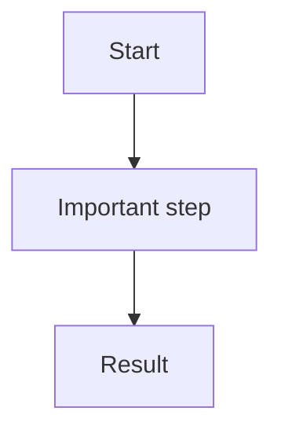

# {{Page Title}}

## Purpose

Describe the responsibility of this area.

## When this runs

Describe when this flow, module, service, endpoint, job, or consumer is used.

## Main flow

1. Step one.
2. Step two.
3. Step three.

## Key components

| Component | Responsibility |
| --- | --- |
| `path/to/File.cs` | Explain responsibility. |

## Configuration

| Key / file | Meaning |
| --- | --- |
| `appsettings.json` | Relevant settings. |

## Failure modes and troubleshooting

| Symptom | Likely cause | Where to check |
| --- | --- | --- |
| Example failure | Example cause | Logs, tests, or source. |

## Source map

- `src/...`
- `tests/...`

## Open questions

- Unclear behavior or missing docs.
