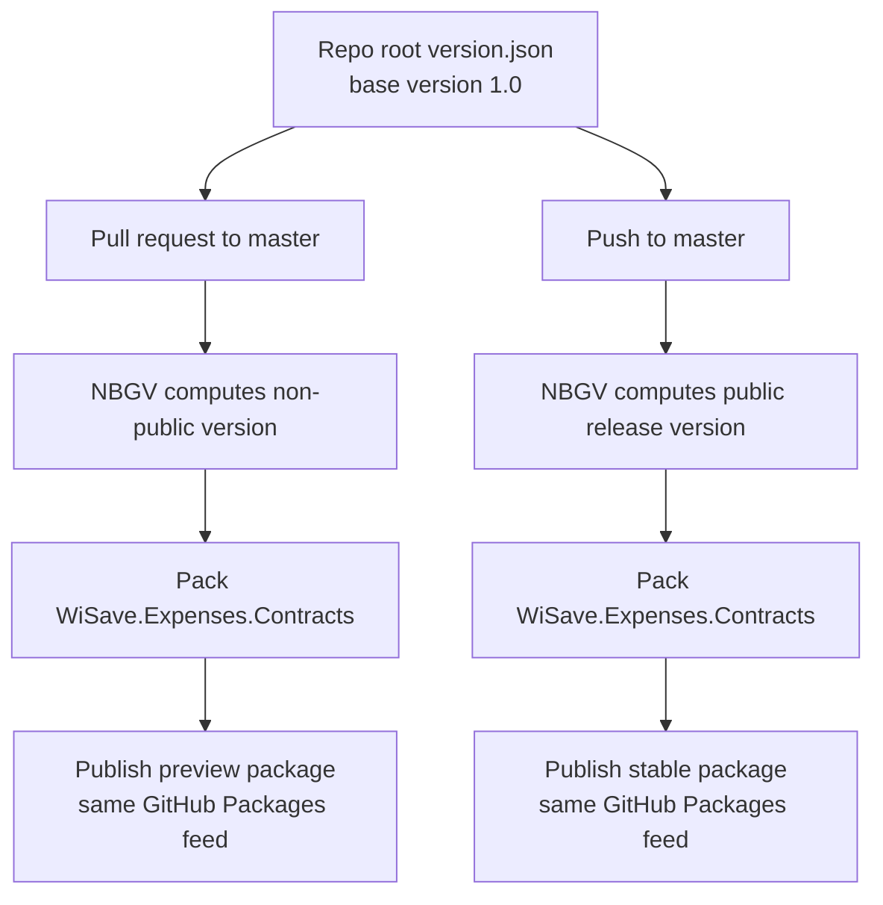

# Contracts Versioning With Nerdbank.GitVersioning

**Date:** 2026-04-14
**Status:** Approved
**Driven by:** Contracts NuGet packaging review, desire to remove manual version bumps, and official Nerdbank.GitVersioning guidance

## Context

`WiSave.Expenses.Contracts` is the only project in this repository currently intended to ship as a NuGet package. Today the package version is hardcoded in `src/WiSave.Expenses.Contracts/WiSave.Expenses.Contracts.csproj`, and publishing is handled by `.github/workflows/publish-contracts.yml`.

That setup has three problems:

- package versioning is manual
- a contracts change can be merged without a version bump
- `dotnet nuget push --skip-duplicate` can hide a missed release by producing a green workflow that publishes nothing new

The target behavior for contracts is different from the earlier MinVer discussion:

- no release tags required for contracts packages
- pull requests targeting `master` should publish preview packages
- merges to `master` should publish a stable package
- preview and stable packages should use the same package ID and GitHub Packages feed

This makes `Nerdbank.GitVersioning` a better fit than `MinVer`. Official NBGV guidance explicitly supports deterministic, commit-derived versions without tags and uses `publicReleaseRefSpec` to distinguish public release refs from non-public refs.

## Change 1: Adopt NBGV For Contracts Package Versioning

### What

Introduce `Nerdbank.GitVersioning` for package version calculation and remove the hardcoded `<Version>` from the contracts project.

Create a repo-root `version.json` with:

- base version `1.0`
- `publicReleaseRefSpec` configured for `refs/heads/master`
- `pathFilters` limited to the contracts subtree and workflow/config files that should affect contracts package version height

Add the `Nerdbank.GitVersioning` package reference to the contracts project with `PrivateAssets="all"` so version stamping applies during build and pack without leaking as a consumer dependency.

### Why

This gives the repository deterministic package versions for every commit while keeping the public-release line stable and sortable for consumers:

- PR builds remain unique because non-public refs include prerelease/commit identity
- `master` builds are public releases and drop the commit-hash suffix
- the patch component advances with git height inside the `1.0` line

That means the repository can produce versions along these lines:

- PR build: `1.0.24-gabc123...` or equivalent NBGV non-public package version
- `master` build: `1.0.25`

The exact formatting remains NBGV-controlled; the key design point is unique preview versions for PRs and stable sortable versions from `master`.

## Change 2: Scope Version Height To Contracts-Relevant Changes

### What

Use `pathFilters` in `version.json` so unrelated commits do not bump the contracts package version.

The first implementation should include these paths:

- `src/WiSave.Expenses.Contracts`
- `.github/workflows/publish-contracts.yml`
- `.github/workflows/pr-contracts-preview.yml`
- `version.json`

### Why

By default, NBGV considers the entire repository when computing version height. This repository is a monorepo-style service repository with multiple executables, workers, migrations, and tests. Without path filters, a change to unrelated code would still advance the contracts package patch version.

Constraining height to contracts-relevant files keeps package version increments meaningful and aligns with the actual publish surface.

## Change 3: Split CI Into Preview And Stable Publish Flows

### What

Use two GitHub Actions workflows for `WiSave.Expenses.Contracts`:

1. PR preview workflow
   - trigger: pull requests targeting `master`
   - build and pack the contracts project
   - publish the preview package to the existing GitHub Packages feed

2. Stable publish workflow
   - trigger: pushes to `master`
   - build and pack the contracts project
   - publish the resulting package to the same GitHub Packages feed

The existing `publish-contracts.yml` can stay as the stable publish workflow, and a new PR-focused workflow can be added alongside it.

### Why

The repository needs two distinct behaviors:

- every PR should produce a consumable preview package
- every merge to `master` should produce the next stable package without requiring a manual tag

Separating these workflows makes the intent explicit, avoids branching logic in a single job, and keeps GitHub permissions simpler to reason about.

## Version Flow

## Repository Shape After The Change

### New file

`version.json`

### Modified files

- `src/WiSave.Expenses.Contracts/WiSave.Expenses.Contracts.csproj`
- `.github/workflows/publish-contracts.yml`

### New workflow

`.github/workflows/pr-contracts-preview.yml`

## Expected Behavior

### Pull requests to `master`

- package build succeeds without editing a version in the `.csproj`
- generated package version is unique for the PR commit
- preview package is published to GitHub Packages under `WiSave.Expenses.Contracts`

### Pushes to `master`

- package build succeeds without editing a version in the `.csproj`
- generated package version is a public-release version in the `1.0.x` line
- stable package is published to GitHub Packages under the same package ID

### Unrelated repository changes

- do not advance the contracts package version when they fall outside the configured path filters

## Testing

Verification should cover:

- local `dotnet pack src/WiSave.Expenses.Contracts/WiSave.Expenses.Contracts.csproj -c Release` produces an NBGV-derived package version
- local build metadata shows the hardcoded `<Version>` is no longer the source of truth
- PR workflow produces a preview package version
- push workflow on `master` produces a public-release package version
- generated package metadata still includes repository URL and commit information

## Risks And Constraints

- Preview and stable packages share the same package ID and feed. That is intentional, but consumers must opt into preview versions when needed.
- If path filters are too narrow, a package-affecting change may not advance version height.
- If path filters are too broad, unrelated changes will continue bumping contracts versions.
- NBGV version behavior depends on committed git history; workflow checkout depth must not break version calculation.

## Out Of Scope

- Migrating any project other than `WiSave.Expenses.Contracts` to package publishing
- Repo-wide rollout of NBGV to all projects
- Changing the package ID or package feed
- Introducing release tags as part of the contracts publish process
